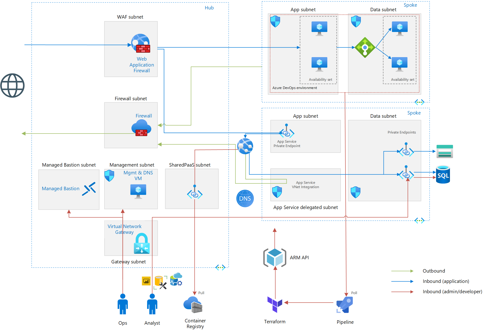

# Automated VDC
This project contains a sample Virtual Network deployment, typically used as part of a Virtual Datacenter (VDC)
It does not contain all components of a complete VDC (DNS, AD DC's, File Transfer)

## Components & Features
This projects contains the following components
- A Virtual Network with subnet segregation (dmz, app, data, mgmt)
- Azure Firewall used as Internet Access Gateway (IAG, e.g. outbound fqdn whitelisting)
- Application Gateway as Web Application Firewall (WAF, inbound HTTP)
- Application VM's with IIS enabled, as Azure Pipeline agent deployed
- A Bastion server that is used as jump server to connect to other VM's. Note this should not be needed in practice as all operation should use Infrastructure as Code (cattle vs. pets) approach
- Additional Managed Bastion (service in preview) as `azurerm_template_deployment` resource (Terraform manages dependencies). You can access the Managed Bastion using this [Portal link](https://aka.ms/BastionHost). The Bastion VM will be removed once the Managed Bastion reaches General Availability.
- Several PaaS services connected as Service Endpoints into the AzureFirewall subnet
- A Point to Site (P2S VPN), that can be leveraged for transitive access to PaaS services using HTTPS Service Endpoints
- Infrastructure provisioning through Terraform, PowerShell and (optionally) Azure Pipeline
- AppServers auto-joined to Azure Pipelines Deployment Group, application deployment from Azure Pipeline

## Pre-Requisites
These project uses Terraform, PowerShell Core with Az module, ASP.NET (Windows Only), and Azure Pipelines. You will need an Azure subscription for created resources and Terraform Backend. Use the links below and/or a package manager of your choice (e.g. brew, chocolatey, scoop) to install required components.

## Setting up Terraform
1.	Clone repository (e.g. using Visual Studio Code, GitHub Desktop).
2.  Set up storage account and service principal for Terraform Azure Backend, and configure environment variables `ARM_SUBSCRIPTION_ID`, `ARM_TENANT_ID`, `ARM_CLIENT_ID`, `ARM_CLIENT_SECRET` accordingly as well as `backend.tf`.
3.	Initialize Terraform backend by running `terraform init` or `tf_deploy.ps1 -init`
4.	To deploy the VPN, set `deploy_vpn = true` in `variables.tf` or your `.auto.tfvars` file. Run `create_certs.ps1` (Windows only unfortunately) to create the certificates required.
5.  To use HTTPS for the demo app, set `use_vanity_domain_and_ssl = true` in `variables.tf` or your `.auto.tfvars` file. You will need to configure SSL using the `vanity_` variables
6.  Create Azure Pipelines [Deployment Group](https://docs.microsoft.com/en-us/azure/devops/pipelines/release/deployment-groups/?view=azure-devops), to be used for ASP.NET application
7.  Customize `variables.tf` or create a `.auto.tfvars` (see `config.auto.tfvars.sample`) file that contains your customized (e.g. secrets) configuration
8.  Run `terraform plan` or `tf_deploy.ps1 -plan` to simmulate what happens if terraform would provision resources. 
9.  Run `terraform apply` or `tf_deploy.ps1 -apply` to create resources. 
10.  Create build pipeline to build ASP.NET app `SampleIisWebApp`, see `azure-pipelines.yml`
11.  Create release pipeline to deploy built ASP.NET `SampleIisWebApp` app to VDC app servers
12.	Run `print_hosts_file_entries.ps1` to get the input for hosts file on the P2S client that is needed for tunneled Service Endpoint access

## Sources
- [Azure Pipelines](https://azure.microsoft.com/en-us/services/devops/pipelines/)
- [PowerShell Core](https://github.com/PowerShell/PowerShell)
- [PowerShell Azure Module](https://github.com/Azure/azure-powershell)
- [Terraform Azure Backend](https://www.terraform.io/docs/providers/azurerm/index.html)
- [Terraform Azure Provider](https://www.terraform.io/docs/backends/types/azurerm.html)
- [Terraform Download](https://www.terraform.io/downloads.html)
- [Terraform Learning](https://learn.hashicorp.com/terraform/)
- [Visual Studio Code](https://github.com/Microsoft/vscode)
- [Visual Studio](https://visualstudio.microsoft.com/free-developer-offers/)

## Limitations & Known Issue's
- Release Pipelines not yet available in YAML

## Integration
- Add any resources created in embedded ARM templates to the Terraform `arm_resource_ids` output list. This will let `tf_deploy.ps1` know to clean up these resources during a `destroy` operation, as Terraform doesn't know about them.
- Terraform output is exported as ad-hoc Azure Pipeline variables by `tf_deploy.ps1`, so they can be used un subsequent tasks

## Disclaimer
This project is provided as-is, and is not intended as a blueprint on how a VDC should be deployed, or Azure components and Terraform should be used. It is merely an example on how you can use the technology. The project creates a number of Azure resources, you are responsible for monitoring and managing cost.