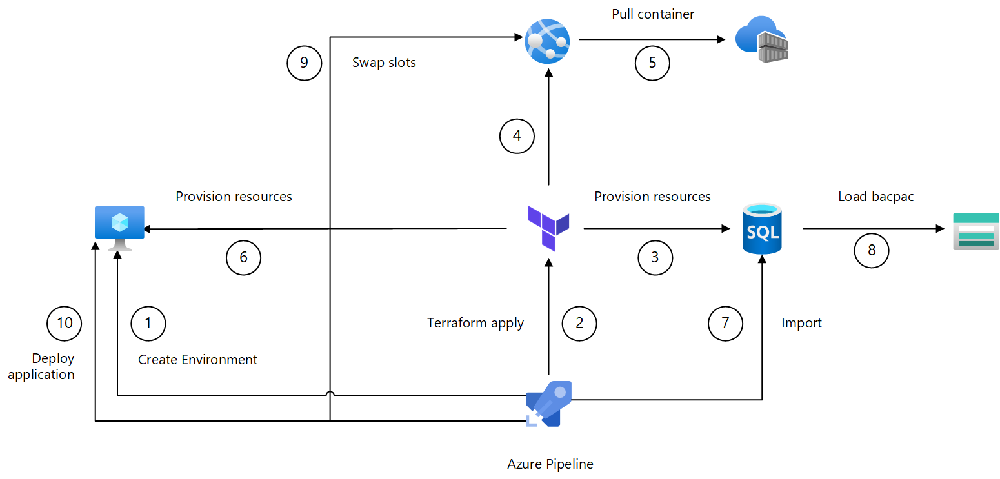

# Automated VDC
This project contains a sample starter Virtual Datacenter (VDC), which follows a Hub & Spoke network topology. Two demo applications (one IaaS, one PaaS) are deployed into it.

## TL;DR, give me the Quickstart

- Setup [option A](#option-a-local-terraform) is the fastest way to provision infrastructure if you already have Azure CLI and Terraform set up. You can use any shell.   
- Setup [option B](#option-b-visual-studio-codespace) is the fastest if you have nothing set up yet. All you need is a browser (Chrome or Edge) and an Azure account (which you need anyway).

## Architecture description
### Infrastructure

This repo deploys the following components:

- A hub network with subnets for shared components (dmz, mgmt, etc)
- Azure Firewall used as Internet Access Gateway (egress, outbound FQDN whitelisting)
- Application Gateway as Web Application Firewall (WAF, HTTP ingress)
- A Management VM that is used as jump server to connect to other VM's
- A Managed Bastion as well
- A Point to Site (P2S VPN), with transitive access to PaaS services
- An IIS VM application deployed in a spoke network, with subnet segregation (app, data)
- An App Service web application integrated into another spoke network
  - Ingress through Private Endpoint
  - Egress through VNet integration (delegated subnet)
- Several PaaS services connected as Private Endpoints
  

### Identify flow
   

Private networking provides some isolation from uninvited guests. However, a [zero trust](https://www.microsoft.com/security/blog/2019/10/23/perimeter-based-network-defense-transform-zero-trust-model/) 'assume breach' approach uses multiple methods of isolation. This is why identity is called the the new perimeter. With Azure Active Directory Authentication, most application level communication can be locked down and access controlled through RBAC. This is done in the following places:

1. App Service uses Service Principal & RBAC to access Container Registry
1. User AAD auth (SSO with MFA) to App Service web app
1. App Service web app uses MSI to access SQL Database (using least privilege database roles, see [grant_database_access.ps1](./scripts/grant_database_access.ps1))
1. User AAD auth (SSO with MFA) on Point-to-Site VPN
1. User AAD auth to VM's (RDP, VM MSI & AADLoginForWindows extension)
1. SQL Database tools (Azure Data Studio, SQL Server Management Studio) use AAD Autnentication with MFA
1. Azure DevOps (inc. Terraform) access to ARM using Service Principal

### Deployment automation

The diagram conveys the release pipeline, with end-to-end orchestration by Azure Pipelines (YAML). The pipeline provisions infrastructure, and deploys 2 applications:

- An [ASP.NET Core app](https://github.com/geekzter/dotnetcore-sqldb-tutorial) deployed on PaaS App Service, SQl Database & more
- An [ASP.NET Framework application](https://github.com/geekzter/azure-vdc/tree/master/apps/IaaS-ASP.NET) deployed on IaaS VM's 

The high-level pipeline steps are:

1. Create [Pipeline environment](https://docs.microsoft.com/en-us/azure/devops/pipelines/process/environments) using multi-stage YAML pipeline
1. Infrastructure provisioning with Terraform   
This diagram only shows resources (App Service, SQL Database & VM's) that participate in downstream  deployments. Many more resources are created that are not displayed.
1. Provision SQL Database
1. Provision App Service (with SQL DB connection string)
1. App Service pulls configured 
[ASP.NET Core app](https://github.com/geekzter/dotnetcore-sqldb-tutorial) container running offline from database
1. Provision Virtual Machines 
1. Import database (PowerShell with Azure CLI)
1. SQL Database pulls bacpac image
1. Swap deployment slots (PowerShell with Azure CLI)   
[ASP.NET Core app](https://github.com/geekzter/dotnetcore-sqldb-tutorial) now uses live database
1. Deploy [ASP.NET Framework application](https://github.com/geekzter/azure-vdc/tree/master/apps/IaaS-ASP.NET)

## Provisioning
To get started you need [Git](https://git-scm.com/), [Terraform](https://www.terraform.io/downloads.html) (to get that I use [tfenv](https://github.com/tfutils/tfenv) on Linux & macOS and [chocolatey](https://chocolatey.org/packages/terraform) on Windows) and [Azure CLI](http://aka.ms/azure-cli). Make sure you have the latest version of Azure CLI. This requires some tailored work on Linux (see http://aka.ms/azure-cli) e.g. for Debian/Ubuntu:   
`curl -sL https://aka.ms/InstallAzureCLIDeb | sudo bash`    

Alternatively, you can create a Visual Studio Codespace with this repo, using this [link](https://online.visualstudio.com/environments/new?name=azure-vdc&repo=geekzter/azure-vdc)

Make sure you clean up, this creates quite a number of resources (see [disclaimer](#disclaimer)).

### Option A: Local Terraform
Use this option if you're using bash, zsh and/or don't have PowerShell Core. 

1. Clone repository:  
`git clone https://github.com/geekzter/azure-vdc.git`  

1. Change to the [`terraform`](./terraform) directrory  
`cd azure-vdc/terraform`

1. Login into Azure with Azure CLI:  
`az login`   

1. This also authenticates the Terraform [azurerm](https://www.terraform.io/docs/providers/azurerm/guides/azure_cli.html) provider when working interactively. Optionally, you can select the subscription to target:  
`az account set --subscription 00000000-0000-0000-0000-000000000000`   
`ARM_SUBSCRIPTION_ID=$(az account show --query id -o tsv)` (bash, zsh)   
`$env:ARM_SUBSCRIPTION_ID=$(az account show --query id -o tsv)` (pwsh)   

1. You can then provision resources by first initializing Terraform:   
`terraform init`  

1. And then running:  
`terraform apply`

1. When you want to destroy resources, run:   
`terraform destroy`

The default configuration will work with any shell. Additional [features](#feature-toggles) may require PowerShell. 

### Option B: Visual Studio Codespace
This will use [Visual Studio Codespaces](https://online.visualstudio.com/) as the environment to provision from. A Codespace is an online version of Visual Studio Code, with a repository cloned into it.   

In this option, Terraform can use optional Azure backend state, and invocation is wrapped by [tf_deploy.ps1](./scripts/tf_deploy.ps1). This unlocks all [features](#feature-toggles), as some features are dependent on using [PowerShell](https://github.com/PowerShell/PowerShell#get-powershell) (run from Terraform [local-exec provisioner](https://www.terraform.io/docs/provisioners/local-exec.html)).

1. Create a Codespace by following this [link](https://online.visualstudio.com/environments/new?name=azure-vdc&repo=geekzter/azure-vdc). This should prompt you to clone this repo when creating the Codepace.

1. Once the Codespace has been created, open a terminal by typing Ctrl-` (backquote)

1. Install Terraform using [tfenv](https://github.com/tfutils/tfenv):   
`git clone https://github.com/tfutils/tfenv.git ~/.tfenv`   
`sudo ln -s ~/.tfenv/bin/* /usr/local/bin`   
`tfenv install`

1. Change to the [`scripts`](./scripts) directory and start powershell:   
`cd ~/workspace/azure-vdc/scripts`   
`pwsh`   
(you can also change the default shell to pwsh)

1. (Optional) A [Terraform Backend](https://www.terraform.io/docs/backends/index.html) allows multi-host, multi-user collaboration on the same Terraform configuration. To set up a [Terraform Azure Backend](https://www.terraform.io/docs/backends/types/azurerm.html), create a storage account and configure `backend.tf` (copy [`backend.tf.sample`](./terraform/backend.tf.sample)) with the details of the storage account you created. Make sure the user used for Azure CLI has the [Storage Blob Data Contributor](https://docs.microsoft.com/en-us/azure/role-based-access-control/built-in-roles#storage-blob-data-contributor) or [Storage Blob Data Owner](https://docs.microsoft.com/en-us/azure/role-based-access-control/built-in-roles#storage-blob-data-owner) role (it is not enough to have Owner/Contributor rights, as this doesn't grant Data Plane access). Alternatively, you can set `ARM_ACCESS_KEY` or `ARM_SAS_TOKEN` environment variables e.g.  
`$env:ARM_ACCESS_KEY=$(az storage account keys list -n STORAGE_ACCOUNT --query "[0].value" -o tsv)`   
or   
`$env:ARM_SAS_TOKEN=$(az storage container generate-sas -n STORAGE_CONTAINER --permissions acdlrw --expiry 202Y-MM-DD --account-name STORAGE_ACCOUNT -o tsv)`   

1. Configure Azure subscription to use e.g.   
`$env:ARM_SUBSCRIPTION_ID=$(az account show --query id -o tsv)`

1. Initialize Terraform backend by running  
`./tf_deploy.ps1 -init` (if you set up Terraform backend state and configured `backend.tf`)   
`./tf_deploy.ps1 -init -nobackend` (local Terraform state)   

1. (Optional) Customize `variables.tf` or create a `.auto.tfvars` file that contains your customized configuration (see [Features](#feature-toggles) below)

1. Run  
`./tf_deploy.ps1 -apply`  
to provision resources (this will first create a plan that you will be prompted to apply)

1. When you want to destroy resources, run:   
`./tf_deploy.ps1 -destroy` (with Terraform, recommended)   
or    
`./erase.ps1 -destroy` (with Azure CLI, as a last resort)   

### Option C: Azure Pipelines
Aforementioned options only provision infrastructure, and does so interactively. There are a number of [pipelines](./pipelines) that do this end-to-end and also deploy 2 demo applications:

- [vdc-terraform-apply-ci.yml](./pipelines/vdc-terraform-apply-ci.yml)   
CI pipeline that does a full provisioning, deployment and tear down
- [vdc-terraform-apply-release.yml](./pipelines/vdc-terraform-apply-release.yml)   
Release pipeline that takes artifacts published by CI pipeline
- [vdc-terraform-apply-cd.yml](./pipelines/vdc-terraform-apply-cd.yml)   
CD pipeline that combines both CI & release in a single multi-stage pipeline

All these pipelines share the same [template](./pipelines/templates/vdc-terraform-apply.yml).

## Feature toggles ###
The Automated VDC has a number of features that are turned off by default. This can be because the feature has pre-requisites (e.g. certificates, or you need to own a domain). Another reason is the use of Azure preview features, or features that just simply take a long time to provision. Features are toggled by a corresponding variable in [`variables.tf`](./terraform/variables.tf).
|Feature|Toggle|Dependencies and Pre-requisites|
|---|---|---|
|Azure&nbsp;Bastion. Provisions the [Azure Bastion](https://azure.microsoft.com/en-us/services/azure-bastion/) service in each Virtual Network|`deploy_managed_bastion`|None|
|Monitoring&nbsp;VM&nbsp;Extensions. Controls whether these extensions are provisioned: `IaaSDiagnostics`, `MicrosoftMonitoringAgent`, `DependencyAgentWindows`|`deploy_monitoring_vm_extensions`|None|
|Non&#x2011;essential&nbsp;VM&nbsp;Extensions. Controls whether these extensions are provisioned: `TeamServicesAgent` (for VM's that are not a deployment target for an Azure Pipeline), `BGInfo`|`deploy_non_essential_vm_extensions`|PowerShell 7|
|[Network&nbsp;Watcher](https://azure.microsoft.com/en-us/services/network-watcher/)|`deploy_network_watcher`|`deploy_non_essential_vm_extensions` also needs to be set. This requires PowerShell 7|
|Security&nbsp;VM&nbsp;Extensions. Controls whether these extensions are provisioned: `AADLoginForWindows`, `AzureDiskEncryption`|`deploy_security_vm_extensions`|None|
|VPN, provisions [Point-to-Site (P2S) VPN](https://docs.microsoft.com/en-us/azure/vpn-gateway/vpn-gateway-howto-point-to-site-rm-ps)|`deploy_vpn`|You need to have the [Azure VPN application](https://go.microsoft.com/fwlink/?linkid=2117554) [provisioned](https://docs.microsoft.com/en-us/azure/vpn-gateway/openvpn-azure-ad-tenant) in your Azure Active Directory tenant.|
|Disable all access public ip address of SQL Database, regardless of SQL Firewall settings|`disable_public_database_access`|`enable_private_link` also needs to be set|
|AAD&nbsp;Authentication. [Configure](https://docs.microsoft.com/en-us/azure/app-service/configure-authentication-provider-aad) App Service to authenticate using Azure Active Directory|`enable_app_service_aad_auth`|SSL and a vanity domain needs to have been set up. You also need to [create](https://docs.microsoft.com/en-us/azure/app-service/configure-authentication-provider-aad) an Azure AD App registration and configure the `paas_aad_auth_client_id_map` map for at least the `default` workspace (see example in [config.auto.tfvars.sample](./terraform/config.auto.tfvars.sample))). (Note: Terraform could provision this pre-requiste as well, but I'm assuming you don't have suffiient AAD permissions as this requires a Service Principal to create Service Principals in automation)|
|[Private Link](https://azure.microsoft.com/en-us/services/private-link/)|`enable_private_link`|None|
|Grant access to SQL Database for App Service MSI and user/group defined by `admin_object_id`. This is required for database import and therefore application deployment|`grant_database_access`|PowerShell 7|
|Limits access to PaaS services to essential admin IPs, Virtual Networks|`restrict_public_access`|PowerShell 7.     Scripting is required for reentrancy. The Terraform IP can change as multiple users collaborate, you simply execute from a different location, or your ISP gave you a dynamic IP address.|
|Pipeline&nbsp;agent&nbsp;type. By default a [Deployment Group](https://docs.microsoft.com/en-us/azure/devops/pipelines/release/deployment-groups/) will be used. Setting this to `true` will instead use an [Environment](https://docs.microsoft.com/en-us/azure/devops/pipelines/process/environments)|`use_pipeline_environment`|Multi-stage YAML Pipelines|
|SSL&nbsp;&&nbsp;Vanity&nbsp;domain. Use HTTPS and Vanity domains (e.g. yourdomain.com)|`use_vanity_domain_and_ssl`|You need to own a domain, and delegate the management of the domain to [Azure DNS](https://azure.microsoft.com/en-us/services/dns/). The domain name and resource group holding the Azure DNS for it need to be configured using `vanity_domainname` and `shared_resources_group` respectively. You need a wildcard SSL certificate and configure its location by setting `vanity_certificate_*` (see example in [config.auto.tfvars.sample](./terraform/config.auto.tfvars.sample)).

## Dashboard
A portal dashboard will be generated:   

This dashboard can be reverse engineered into the template that creates it by running:   
`templatize_dashboard.ps1`   
This recreates `dashboard.tpl`, which in turn generates the dashboard. Hence full round-trip dashboard editing support is provided.

## Resources
- [Azure CLI](http://aka.ms/azure-cli)
- [Azure Pipelines](https://azure.microsoft.com/en-us/services/devops/pipelines/)
- [PowerShell Core](https://github.com/PowerShell/PowerShell)
- [Terraform Azure Backend](https://www.terraform.io/docs/backends/types/azurerm.html)
- [Terraform Azure Provider](https://www.terraform.io/docs/providers/azurerm/index.html)
- [Terraform on Azure documentation](https://docs.microsoft.com/en-us/azure/developer/terraform)
- [Terraform Learning](https://learn.hashicorp.com/terraform?track=azure#azure)
- [Visual Studio Code](https://github.com/Microsoft/vscode)

## Disclaimer
This project is provided as-is, and is not intended as a blueprint on how a VDC should be deployed, or Azure components and Terraform should be used. It is merely an example on how you can use the technology. The project creates a number of Azure resources, you are responsible for monitoring and managing cost. You can configure auto shutdown on VM's through the Azure Portal, with the [Start/stop VMs during off-hours solution](https://docs.microsoft.com/en-us/azure/automation/automation-solution-vm-management), or with functions in my [azure-governance](https://github.com/geekzter/azure-governance/tree/master/functions) repo.